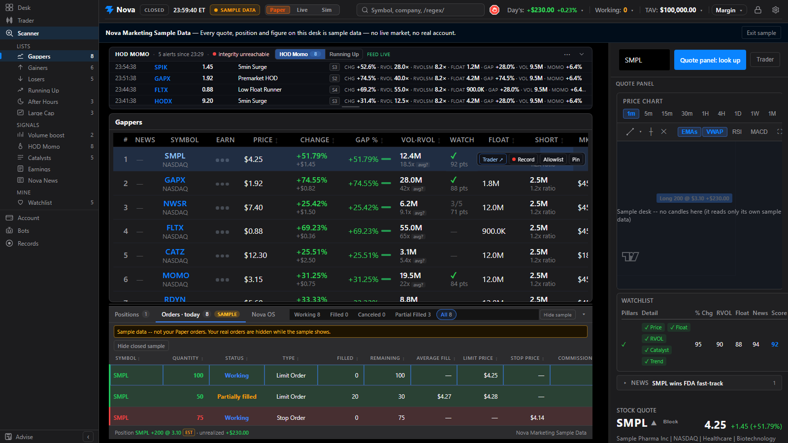

# Nova

Local-first Interactive Brokers trading workstation. Scanner, charts, Trader View, and gated orders run on your machine. The public site is marketing only. This repository is the source.

[](https://github.com/aaltaay/Nova/actions/workflows/deploy.yml)
[](LICENSE)

**Site:** [nova.altaystudio.com](https://nova.altaystudio.com) (built from [nova-site](https://github.com/aaltaay/nova-site)) · **Releases:** [GitHub Releases](https://github.com/aaltaay/Nova/releases)



*The Scanner on the built-in sample desk (Nova Marketing Sample Data): every symbol and figure is sample data, not a live market or account.*

## Try it without a broker

The sample desk runs the real UI on built-in sample data. It needs only Node.js 20: no IB Gateway, no API keys, no backend, and it sends nothing anywhere.

```bash
cd frontend
npm install
npm run build
npm run preview
```

Then open <http://localhost:4173/?view=sample>. **Exit sample** in the header leaves it.

## What it is

Nova is a single-operator desk for US equities:

- Persistent IBKR scanner rosters (Gappers, Gainers, Afterhours, Large Cap)
- HOD Momo alerts from names already on the desk
- Store-first IBKR charts
- Trader View with Level 2, Time & Sales, and a ticket (depth-plan cap)
- News: on-roster catalysts plus an AI-in-trading desk
- Optional paper or live orders through one execution command

It is not a hosted brokerage, not a cloud scanner, and not an unattended trading bot.

## Safety

| Gate | Default |
|------|---------|
| Market data | Interactive Brokers only |
| Alpaca | News and listing metadata only |
| Orders | Off until `IBKR_ENABLED` and `IBKR_ORDERS_ENABLED` |
| Live money | Also requires `IBKR_LIVE_TRADING_CONFIRMED` |
| Short entry | Off until `IBKR_SHORT_ENABLED` plus an explicit `short_entry` on the command |
| `auto_live` | Rejected in code. Do not enable it. |

The API binds to `127.0.0.1:8000`. Do not expose it to the internet.

## Practice Sim

Header **Paper / Live / Sim** replays a real recorded or downloaded session and fills practice orders in a local ledger, with no Gateway. It is not IBKR paper, and the fills are estimates. See [docs/sim-mode.md](docs/sim-mode.md).

## Requirements

- Windows for the supported desktop and `Run Nova.bat` path
- Python 3.13 and Node.js 20
- [IB Gateway](https://www.interactivebrokers.com/en/trading/ibgateway-stable.php) logged in (live port 4001; the paper Gateway on 4002 is legacy, by hand only)
- Alpaca keys only if you want news and listing flags
- Optional: Finnhub (Earnings calendar), Discord/Telegram (alerts)

## Quick start (Windows)

1. Clone this repository.
2. Copy `.env.example` to `.env`. Leave secrets out of git.
3. In `frontend/`, run `npm install` once.
4. Double-click `Run Nova.bat`.

Expected local endpoints:

- API: [http://127.0.0.1:8000](http://127.0.0.1:8000)
- UI: [http://localhost:5173](http://localhost:5173)

Desktop (Electron + local API sidecar):

```bat
cd frontend
npm install
npm run electron:dev
```

Windows installer:

```bat
cd frontend
npm run electron:pack
```

Output: `frontend/release/Nova-Setup-vNNN.exe` plus `latest.yml` and a `.blockmap` (the in-app update feed). The packaged app stores keys and cache under `%APPDATA%\Nova\`, so an update never touches your settings.

## Releases

Public revision is **`vNNN`**: `v` plus the git commit count, at least three digits. Git history is the source of truth — `VERSION` and `frontend/package.json`'s `0.1.N` are **generated build artifacts**, not repo content. `VERSION` is gitignored and `package.json` stays `0.0.0-dev` in git; CI regenerates both with `py -3 tools/bump_version.py --sync` before packing. A working clone derives the tag from git automatically, so there is nothing to install and no commit ever diffs a version file (see [#344](https://github.com/aaltaay/Nova/issues/344)).

Pull requests build and verify the installer as a workflow artifact. Every commit that lands on `master` is tagged `vNNN`, and an application-affecting one is published as that GitHub Release with the installer, its `.blockmap` and `latest.yml`. The automatic Source code zip is not the app.

Installed desks check that feed shortly after launch and again every two hours while open (a re-check never runs 07:00-16:00 ET on a weekday). A newer release shows a notice on the desk with its release notes -- **Update** / **Later**: nothing downloads until Update, which fetches the newest release (it asks GitHub again when the notice is more than a minute old), and nothing installs until **Restart to update**. They never install or restart on their own. The first launch after an update shows **What's new**, the notes of every release it brought (Help > What's New reopens them). Each release's notes are its PR's title and the first paragraph of its `## What` (`tools/release_notes.py`). Set `NOVA_UPDATE_CHECK=0` to stop the automatic checks (Help > Check for Updates still works). Builds are unsigned, so SmartScreen warns on a fresh download.

## Configuration

All secrets go in `.env`. The tracked file is `.env.example` (empty placeholders only).

| Variable | Role |
|----------|------|
| `NOVA_DISCOVERY_PROVIDER` | Must stay `ibkr` |
| `APCA_API_KEY_ID` / `APCA_API_SECRET_KEY` | Alpaca news and listing metadata |
| `IBKR_ENABLED` / `IBKR_ORDERS_ENABLED` | Connect and spend |
| `IBKR_LIVE_TRADING_CONFIRMED` | Live money |
| `IBKR_SHORT_ENABLED` | Short entry (Phase K) |
| `NOVA_API_KEY` | Required for `POST /api/config` even on loopback; required for all mutating `/api/*` off loopback |
| `FINNHUB_API_KEY` | Earnings calendar |

Gateway default is live (4001). The IBKR paper Gateway (4002) is legacy -- by hand only (`POST /api/ibkr/gateway-mode {"mode":"paper"}`), never an automatic fallback (ADR 020). Port 4001 listening is not proof of a live account.

## Architecture

| Layer | Location |
|-------|----------|
| Constitution | [AGENTS.md](AGENTS.md) |
| ADRs | [architecture/decisions/](architecture/decisions/) |
| Backend | FastAPI modules under `backend/` (`main.py` is the app factory only) |
| Frontend | React + Vite under `frontend/src/` (`App.tsx` is the shell only) |
| Execution | `execution.service.execute` -- sole broker mutation entry (ADR 007) |
| Feed | IBKR scanner, L1, charts, depth, tape. See `.cursor/rules/single-market-data-feed.mdc` |

## Development

```text
# API
cd backend && python -m uvicorn main:app --reload --host 127.0.0.1 --port 8000

# UI
cd frontend && npm run dev

# Tests
pytest backend/ -q
cd frontend && npm test -- --run && npm run build
python3 tools/doc_invariants.py
```

## Deploy

- **Desk:** local only -- `Run Nova.bat`, Desktop sidecar, or uvicorn on loopback. There is no cloud API host.
- **Marketing:** `nova.altaystudio.com` lives in its own repo, [aaltaay/nova-site](https://github.com/aaltaay/nova-site) -- source, Vercel deploy and the AI-in-trading digest. Nothing in this repo builds or deploys it.
- **App UI:** local Vite or the Desktop installer. Do not host the trading SPA on the public domain.

The older `Nova-public` repository is a private archive. It is not the source home.

## Contributing

See [CONTRIBUTING.md](CONTRIBUTING.md). Pull requests must be ready (not draft) and include verification evidence. GitHub Actions merges when gating CI is green.

## Security

See [SECURITY.md](SECURITY.md). Report vulnerabilities through GitHub Security Advisories. Do not commit `.env` files or tokens.

## License

[MIT](LICENSE). Copyright (c) 2026 Ahmi Altaay.

Not investment advice. Not a hosted brokerage. You are responsible for IBKR permissions, keys, and every order.
