<div align="center">

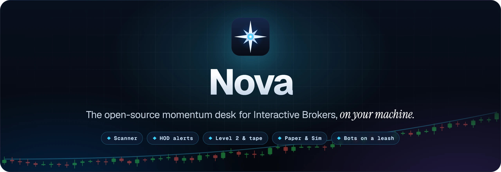

<br />

[](https://github.com/aaltaay/Nova/releases/latest)
[](LICENSE)


**[Live demo](https://nova.altaystudio.com/demo/)** &nbsp;·&nbsp; **[Website](https://nova.altaystudio.com)** &nbsp;·&nbsp; **[Quick start](#quick-start)** &nbsp;·&nbsp; **[Tour](#tour)** &nbsp;·&nbsp; **[Safety](#safety-model)** &nbsp;·&nbsp; **[Architecture](#architecture)** &nbsp;·&nbsp; **[Releases](https://github.com/aaltaay/Nova/releases)**

</div>

<br />

<a href="https://nova.altaystudio.com/demo/">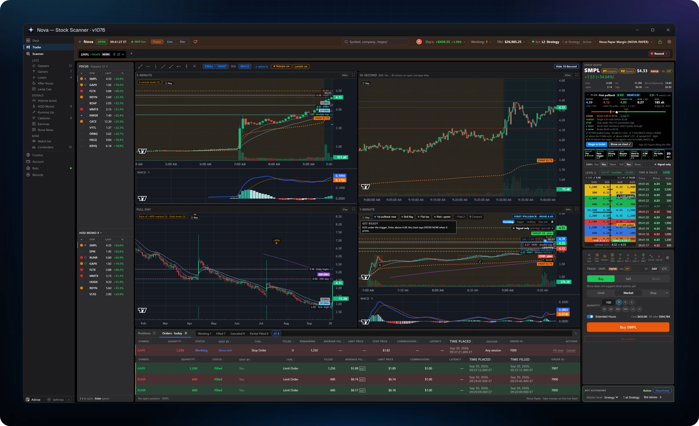</a>

<p align="center"><sub>Every screenshot on this page shows <b>Nova Marketing Sample Data</b>: no live market, no real account. <a href="https://nova.altaystudio.com/demo/">Click around the live demo →</a></sub></p>

## What is Nova?

Nova is a local-first trading workstation for US equities on **Interactive Brokers**, built for small-cap momentum: the stocks that gap, squeeze and make new highs before most people notice.

It finds the movers, alerts you when one breaks its high of day, and shows you the chart, the book and the tape at once. It drafts a plan with a 2:1 target sized to your risk, and it sends every order, whether yours or a bot's, through one safety-checked door. You can practice on a Paper account that rides the live feed, replay any recorded day in Sim, and let a bot trade in practice while it earns your trust.

Everything runs on your PC. The engine binds to `127.0.0.1`, your keys stay in your `.env`, and nothing is hosted.

<table>
  <tr>
    <td width="33%" valign="top">
      <b>Scanner and HOD alerts</b><br />
      Persistent IBKR rosters with float, relative volume, short interest, catalysts and halts. Thirteen high-of-day alert strategies.
    </td>
    <td width="33%" valign="top">
      <b>Trader View</b><br />
      10-second, 1-minute, 5-minute and daily charts beside Level 2 and Time &amp; Sales, with the plan drawn on the chart.
    </td>
    <td width="33%" valign="top">
      <b>One door for every order</b><br />
      Clicks, hotkeys and bots pass the same checks. Live trading arms only with your PIN, and getting flat is never blocked.
    </td>
  </tr>
  <tr>
    <td valign="top">
      <b>Paper and Sim</b><br />
      A practice account on the live feed, plus replays of recorded days that unwind your orders when you scrub back.
    </td>
    <td valign="top">
      <b>Bots on a leash</b><br />
      Off, Eyes or Strategy per setup, loss breakers and a kill switch. Nova's bot trades practice venues only.
    </td>
    <td valign="top">
      <b>Local-first and open</b><br />
      Your machine, your data, your keys. MIT licensed, no subscription, no cloud account.
    </td>
  </tr>
</table>

## Tour

### Scanner and HOD Momo alerts

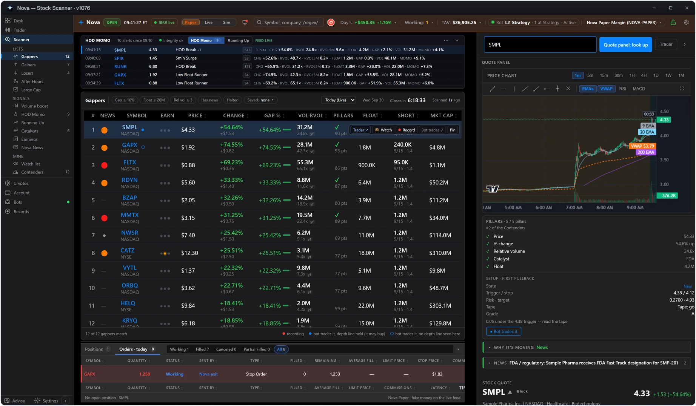

- **Persistent rosters** from IBKR scanner subscriptions: Gappers, Gainers, Losers, After Hours and Large Cap. A name is on the board before its first tick arrives.
- **Every fact you check before a click:** change and gap, volume and relative volume, float (flagged when its own share counts disagree), short interest with its settlement date, market cap, earnings proximity and halts.
- **Catalysts, classified, not guessed.** SEC filings, press wires and the FDA are read into one verdict per stock: a real catalyst, dilution, routine news or noise.
- **HOD Momo** watches every name on the board and fires when one breaks its high of day with the volume to mean it. Thirteen strategies, a master gate for tradeable names only, and bursts that fold into a single row.
- **The quote panel** grades any symbol on five pillars, shows the setup forming on it, and explains why it's moving.

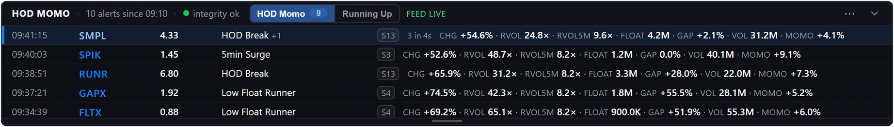

### Trader View

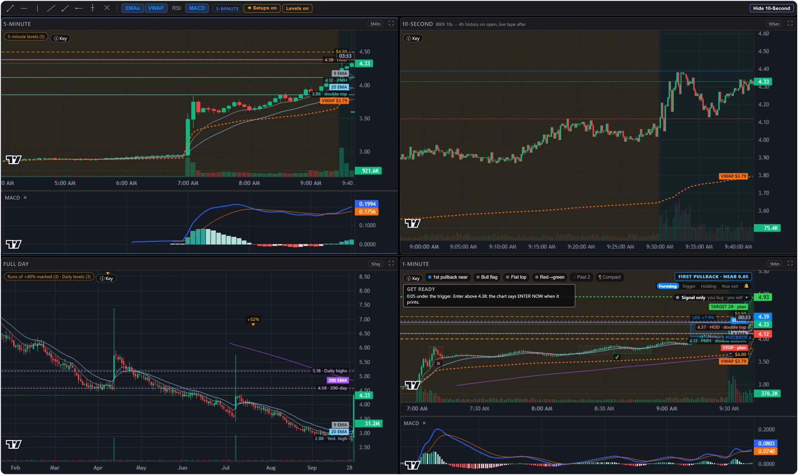

- **Four timeframes in one glance:** 10-second, 1-minute, 5-minute and the full daily history, with VWAP, EMAs, MACD, RSI, session shading and drawing tools.
- **The levels that matter, labeled:** high of day, premarket high, the open, tested tops and bottoms, half and whole dollars, prior daily highs and the 200-day. Each chart draws only what its own candles show.
- **Store-first charts.** Bars paint instantly from the local store while IBKR history fills in behind, so a click never waits on the network.
- **Hotkeys** for every Nova action, including a one-step import of your DAS Trader hotkeys.

### Level 2, Time &amp; Sales and the plan

<table>
  <tr>
    <td width="50%" valign="top">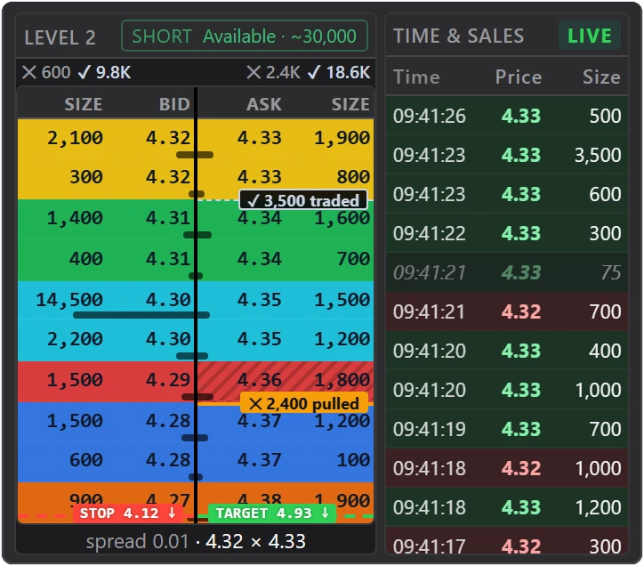</td>
    <td width="50%" valign="top">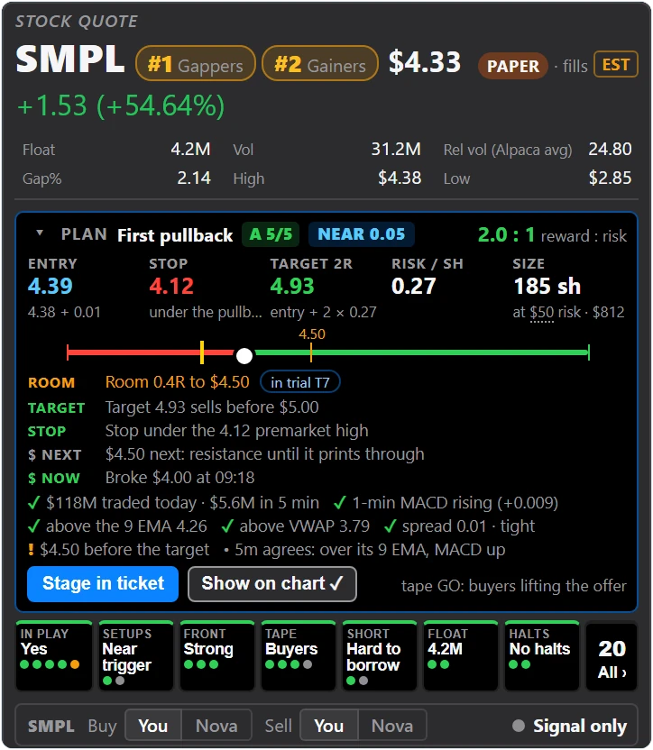</td>
  </tr>
</table>

- **Level 2 that shows what left the book.** Each price tier gets its own color and every size shares one gauge. Size that traded is marked **✓ traded**, size that vanished is marked **✕ pulled**, and hidden buyers and sellers are outlined where they hold. Your entry, stop and target sit inside the book.
- **Time &amp; Sales** colors every print by where it hit (ask, bid or between) and dims the prints that don't set a price, with the reason.
- **A plan before every trade:** the setup forming, an entry, a stop and a 2:1 target sized to your risk per trade, the levels in the way, and every reason *not* to take it, in plain words.
- **Who trades the stock** is your choice per symbol: you alone, Nova with your approval, or Nova by itself on the practice venues.

### Setups drawn as they form

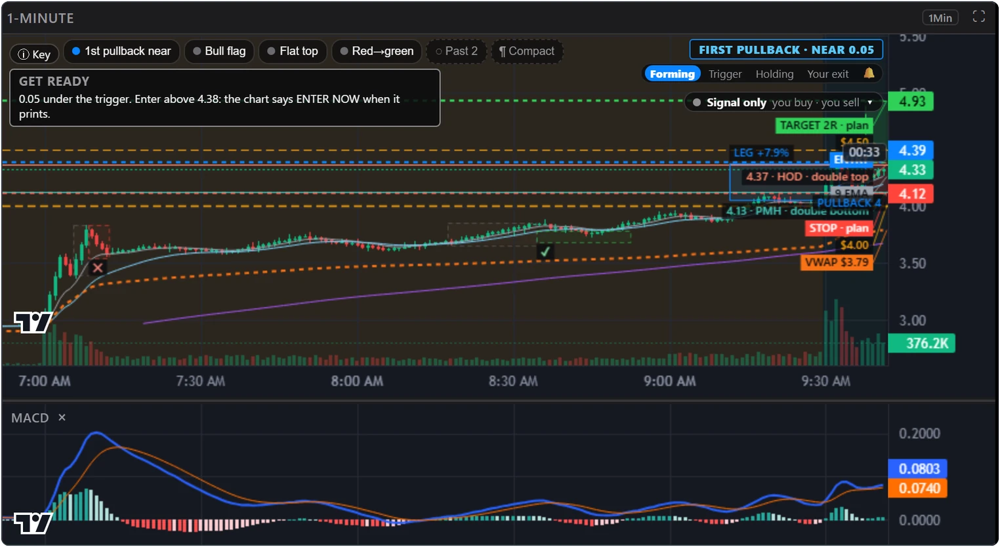

Four setup scanners (first pullback, bull flag, flat-top breakout and red to green) follow every name on the board. Setups are drawn on the chart while they form, then kept as faint history once they fail, fade or trigger, with what price did next. A moment track says where the trade stands: forming, trigger, holding, your exit.

### Contenders and the Setups board

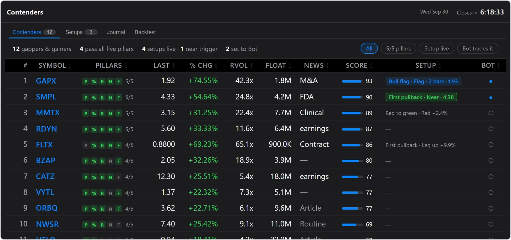

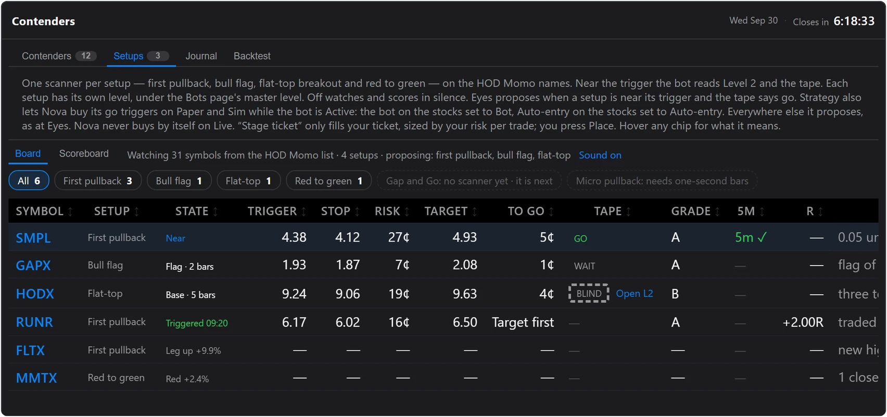

### Practice: Paper and Sim

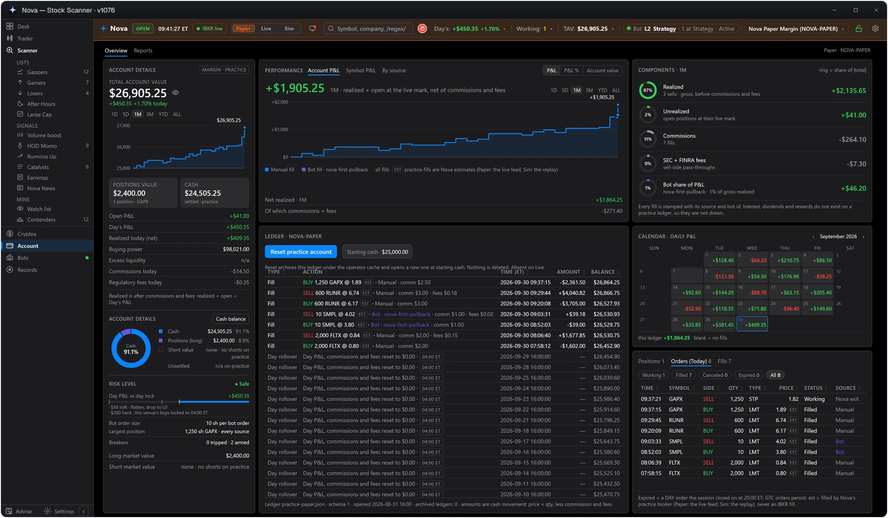

- **Paper** is Nova's practice account on the live feed: real-time data, fake money, broker-style commissions and fees, enforced buying power, and fills estimated locally. Nothing is sent to a broker.
- **Sim** replays a recorded or downloaded session. Scrub the playhead back and every later order unwinds, exactly as if it never happened.
- **The Account page** reads the ledger like a broker statement: equity curve, components, every fill stamped with who sent it, and a P&amp;L calendar.

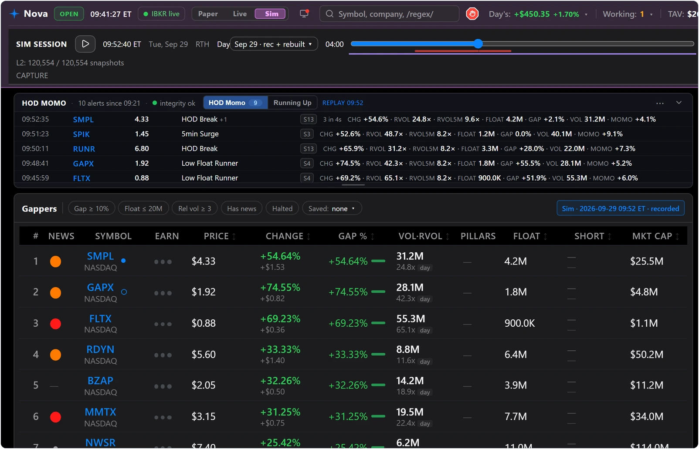

### Bots on a leash

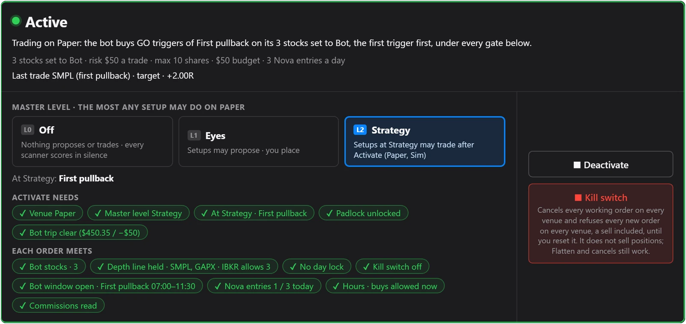

- **Three levels per setup.** Off watches and scores in silence, Eyes proposes trades, and Strategy lets Nova's bot trade its signals once you press Activate.
- **Every gate is visible.** Venue, level, padlock, bot list, depth lines, trading window, daily cap and breakers are each shown with their reason. A bot never buys silently.
- **Loss breakers and a kill switch.** A soft bot trip and a hard all-stop per venue, plus a kill switch that refuses every new order until you reset it.
- **Practice only.** Nova's bot trades Paper and Sim. A localhost API lets your own bot use the same door and the same rules.

### And the rest of the desk

<table>
  <tr>
    <td width="62%" valign="top">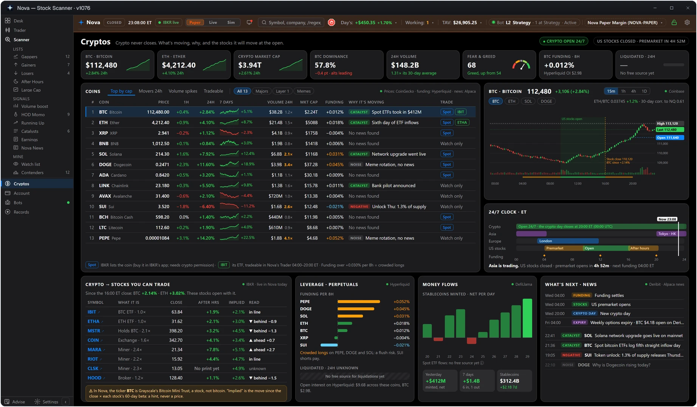</td>
    <td width="38%" valign="top">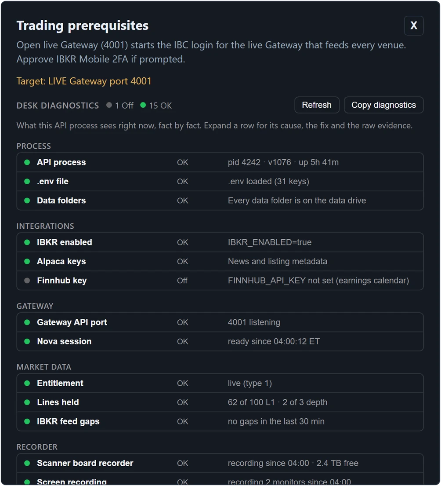</td>
  </tr>
  <tr>
    <td valign="top"><b>Cryptos.</b> A read-only board for the 24/7 market and the stocks it moves at the open.</td>
    <td valign="top"><b>Diagnostics.</b> A checklist of facts about the desk, each with its cause and fix.</td>
  </tr>
</table>

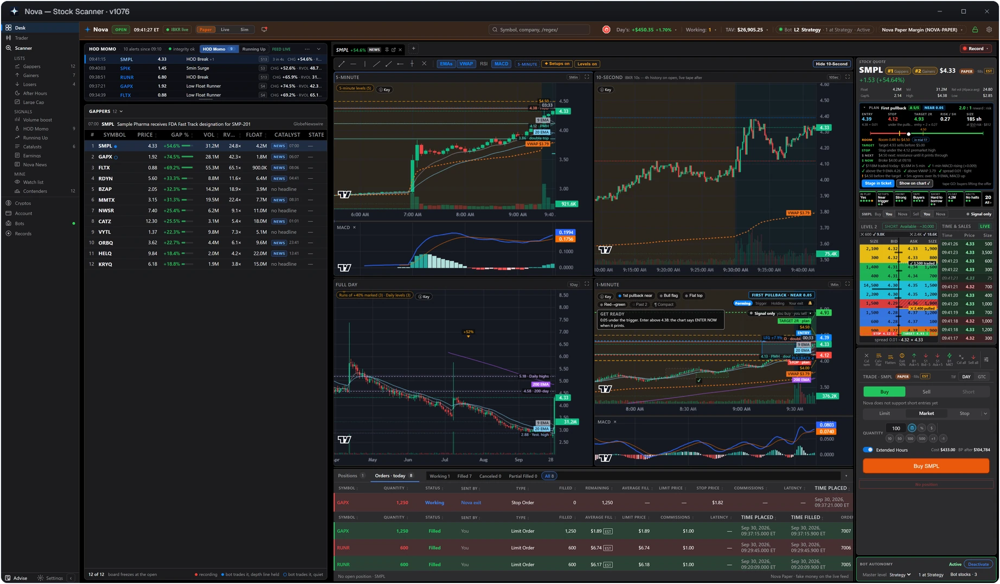

Also on board: a **Session Record** of every print and Level 2 book, **screen recording** with share clips (sizes blurred), P&amp;L reports with R-multiples and drawdown, a catalyst classifier and a **"why it's moving"** read, watch-list toasts, **Ctrl+F** on every screen, and a Windows desktop app that updates itself.

## Try it without a broker

**[Open the live demo](https://nova.altaystudio.com/demo/)**: the whole desk on Nova Marketing Sample Data, running in your browser. Nothing is installed, and nothing you click is sent anywhere.

To run the same demo on your own machine, you need only **Node.js 20**: no IB Gateway, no API keys, no backend.

```bash
git clone https://github.com/aaltaay/Nova.git
cd Nova/frontend
npm install
npm run build:demo
npm run preview:demo
```

Then open <http://localhost:4173/demo/>.

## Quick start

**Requirements**

- Windows for the supported desktop app and the `Run Nova.bat` path
- Python 3.13 and Node.js 20
- [IB Gateway](https://www.interactivebrokers.com/en/trading/ibgateway-stable.php), logged in (live port 4001)
- Optional: Alpaca keys for news and listing metadata, Finnhub for the earnings calendar, Discord or Telegram for alerts

**Run it**

1. Clone this repository.
2. Copy `.env.example` to `.env` and fill in what you use. Secrets never go in git.
3. In `frontend/`, run `npm install` once.
4. Double-click `Run Nova.bat`. The API comes up on <http://127.0.0.1:8000> and the desk on <http://localhost:5173>.

**Desktop app** (Electron with the local API as a sidecar):

```bat
cd frontend
npm install
npm run electron:dev
```

Build the Windows installer with `npm run electron:pack`. It writes `frontend/release/Nova-Setup-vNNN.exe` plus the `latest.yml` and `.blockmap` update feed. The installed app keeps its keys and cache under `%APPDATA%\Nova\`, so an update never touches your settings.

## Safety model

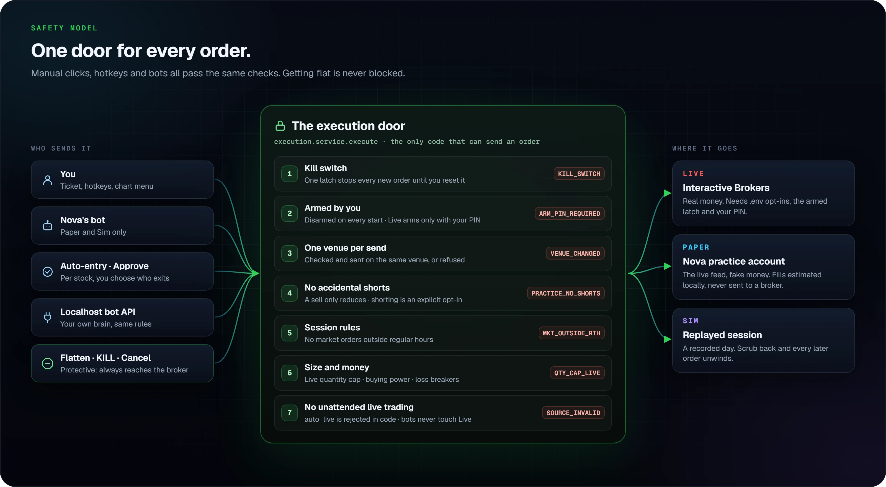

Nova can place real orders, so the defaults are conservative and the gates live in code, not in settings:

| Gate | Default |
|------|---------|
| Market data | Interactive Brokers only. Alpaca supplies news and listing metadata, never prices. |
| Orders | Off until `IBKR_ENABLED` and `IBKR_ORDERS_ENABLED` are set. |
| Live money | Also requires `IBKR_LIVE_TRADING_CONFIRMED`, the armed latch, and your PIN. Every restart disarms. |
| Short entry | Off. A sell only reduces a position unless `IBKR_SHORT_ENABLED` is set, IBKR shows shares to borrow, and the order asks for `short_entry`. |
| Bots | Practice venues only. The localhost bot API refuses Live. |
| `auto_live` | Rejected in code. Unattended live trading does not exist. |

The API binds to `127.0.0.1:8000`. Do not expose it to the internet.

## Architecture

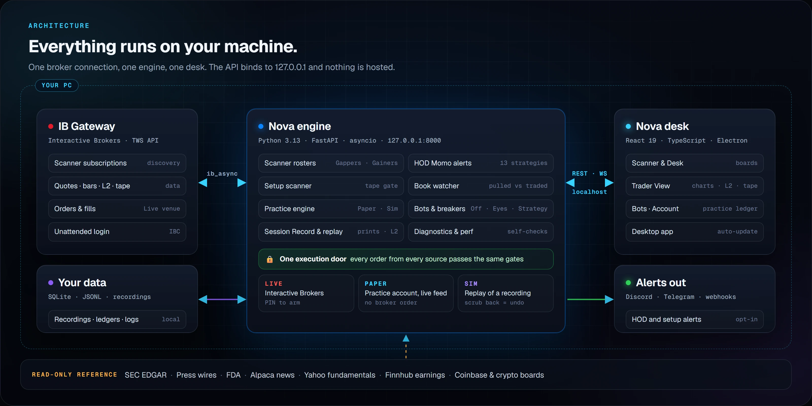

| Layer | Stack | Where |
|-------|-------|-------|
| Engine | Python 3.13, FastAPI, asyncio, `ib_async` | `backend/` (`main.py` is the app factory only) |
| Desk | React 19, TypeScript, Vite, TradingView Lightweight Charts | `frontend/src/` (`App.tsx` is the shell only) |
| Desktop | Electron with the engine as a sidecar, auto-update from GitHub Releases | `frontend/electron/` |
| Storage | SQLite, JSONL and Session Records on your own drive | local only |
| Orders | `execution.service.execute`, the single broker mutation entry | [ADR 007](architecture/decisions/007-centralized-trading-execution.md) |

A modular monolith with ports and adapters, feature slices on the frontend, and an isolated event loop for the broker connection. Each structural decision is written down as an [architecture decision record](architecture/decisions/), including [three venues on one feed](architecture/decisions/020-three-venues-one-feed.md), [IB loop isolation](architecture/decisions/010-ib-loop-isolation.md) and [desk venue vs spend arming](architecture/decisions/018-desk-venue-vs-spend-arming.md).

## Built to be trusted

Nova can place real orders, so it is built like it:

- **Tested where it matters.** pytest covers the engine, Vitest covers the desk, and Playwright drives the real interface in a browser.
- **Decisions written down.** Every structural choice is an [architecture decision record](architecture/decisions/), and [AGENTS.md](AGENTS.md) is the project's constitution, enforced by a maintainer gate in CI.
- **Every change explained.** Each pull request records what changed, why, and how it was verified. Releases are built, versioned and published by CI, and the desktop app updates itself.

<details>
<summary><b>Configuration</b></summary>

<br />

All secrets go in `.env`. The tracked file is `.env.example`, with empty placeholders only.

| Variable | Role |
|----------|------|
| `NOVA_DISCOVERY_PROVIDER` | Must stay `ibkr` |
| `APCA_API_KEY_ID` / `APCA_API_SECRET_KEY` | Alpaca news and listing metadata |
| `IBKR_ENABLED` / `IBKR_ORDERS_ENABLED` | Connect and spend |
| `IBKR_LIVE_TRADING_CONFIRMED` | Live money |
| `IBKR_SHORT_ENABLED` | Short entry |
| `NOVA_API_KEY` | Required for `POST /api/config` even on loopback, and for every mutating `/api/*` call off loopback |
| `FINNHUB_API_KEY` | Earnings calendar |

The Gateway default is live (4001). The IBKR paper Gateway (4002) is legacy: by hand only (`POST /api/ibkr/gateway-mode {"mode":"paper"}`), never an automatic fallback. Port 4001 listening is not proof of a live account.

</details>

<details>
<summary><b>Development</b></summary>

<br />

```text
# API
cd backend && python -m uvicorn main:app --reload --host 127.0.0.1 --port 8000

# Desk
cd frontend && npm run dev

# Tests and checks
pytest backend/ -q
cd frontend && npm test -- --run && npm run build
py -3 tools/maintainer_checks.py --gate --base origin/master
python3 tools/doc_invariants.py
```

See [CONTRIBUTING.md](CONTRIBUTING.md) for your first change in ten minutes.

</details>

<details>
<summary><b>Releases and updates</b></summary>

<br />

The public revision is **`vNNN`**: `v` plus the git commit count. Git history is the source of truth; `VERSION` and the packaged version are build artifacts that CI regenerates.

Every commit that lands on `master` is tagged `vNNN`, and an application-affecting one is published as a GitHub Release with the installer, its `.blockmap` and `latest.yml`. The automatic Source code zip is not the app.

The installed desk checks for a newer release shortly after launch, then re-checks every two hours while open (never 07:00 to 16:00 ET on a weekday). A newer release shows a notice with its release notes, **Update** or **Later**. Nothing downloads before Update and nothing installs before **Restart to update**. Set `NOVA_UPDATE_CHECK=0` to stop the automatic checks. Builds are unsigned, so SmartScreen warns on a fresh download.

</details>

## Contributing

Contributions are welcome. Start with [CONTRIBUTING.md](CONTRIBUTING.md): most of Nova can be worked on without an Interactive Brokers account, IB Gateway or API keys. Pull requests must be ready (not draft) and carry their verification.

## Security

Report vulnerabilities privately through [GitHub Security Advisories](https://github.com/aaltaay/Nova/security/advisories/new). See [SECURITY.md](SECURITY.md). Never commit `.env` files, tokens or account numbers.

## License

[MIT](LICENSE). Copyright (c) 2026 Ahmi Altaay.

<sub>Nova is software, not a brokerage, and nothing here is investment advice. Trading involves risk of loss. You are responsible for your IBKR permissions, your keys and every order you send. Interactive Brokers and IBKR are trademarks of their owners; Nova is not affiliated with them.</sub>
