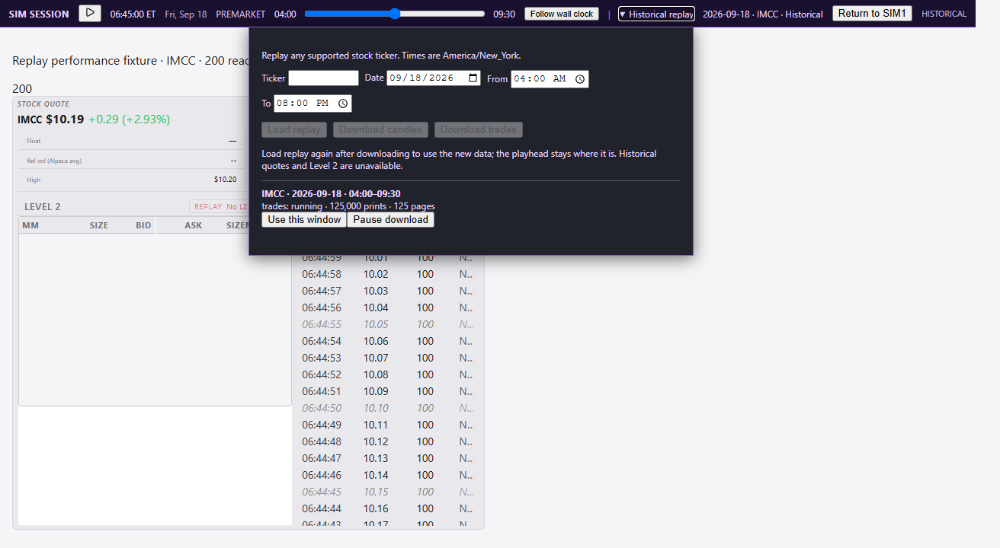
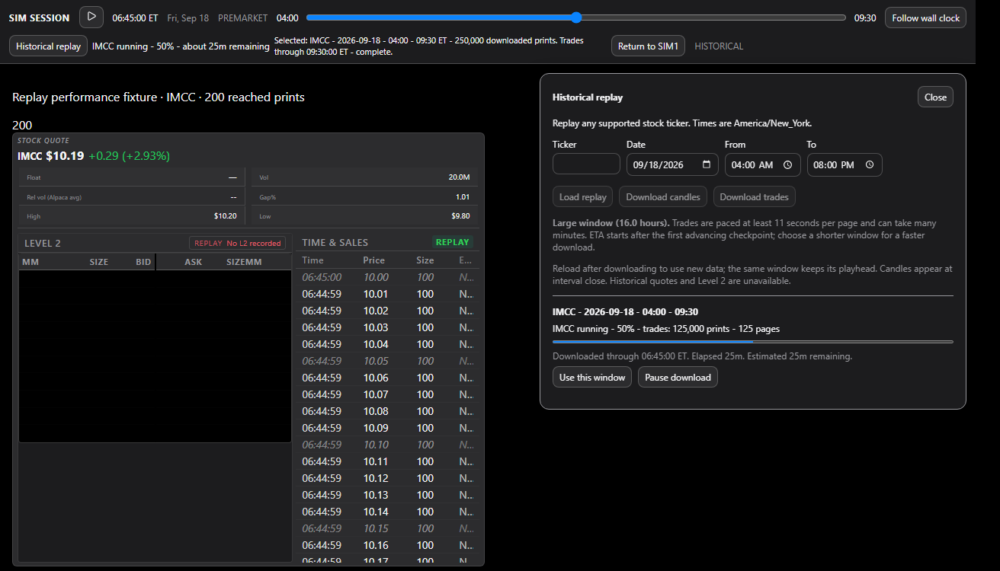
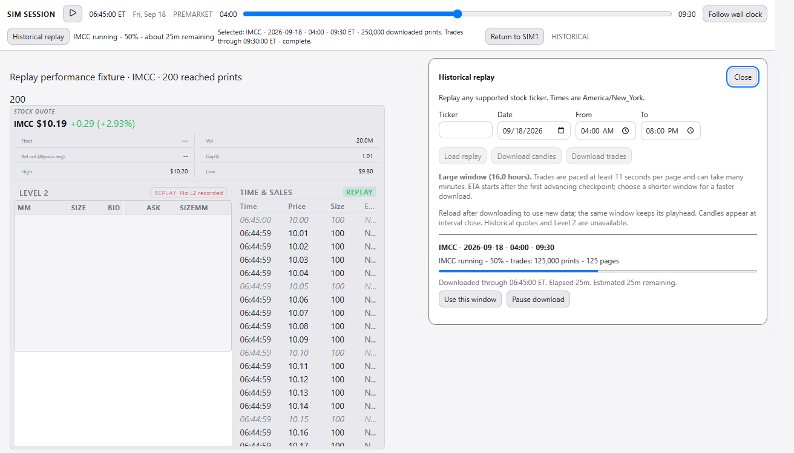
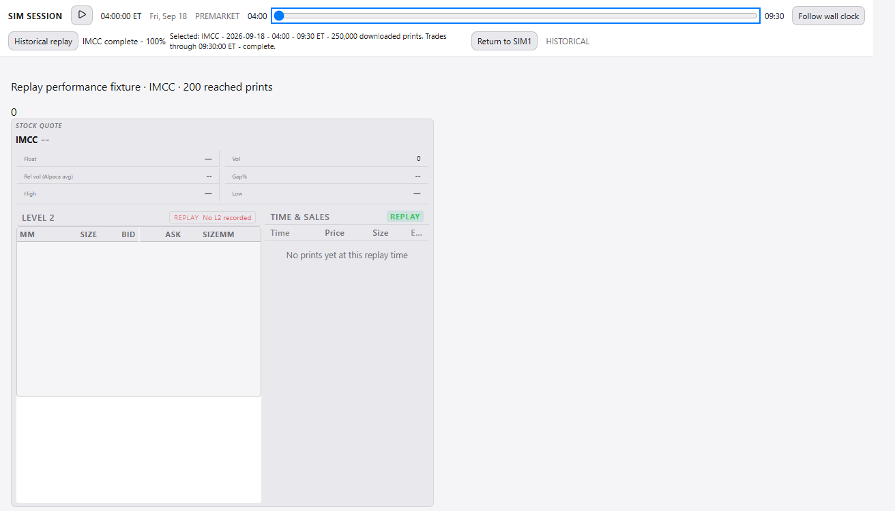
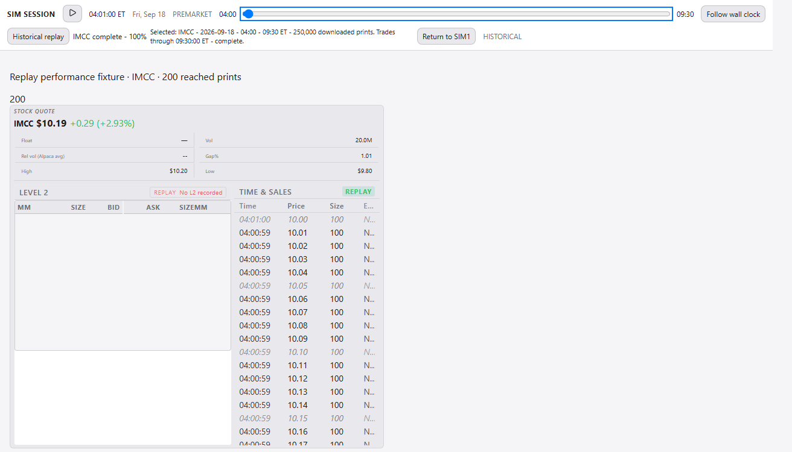
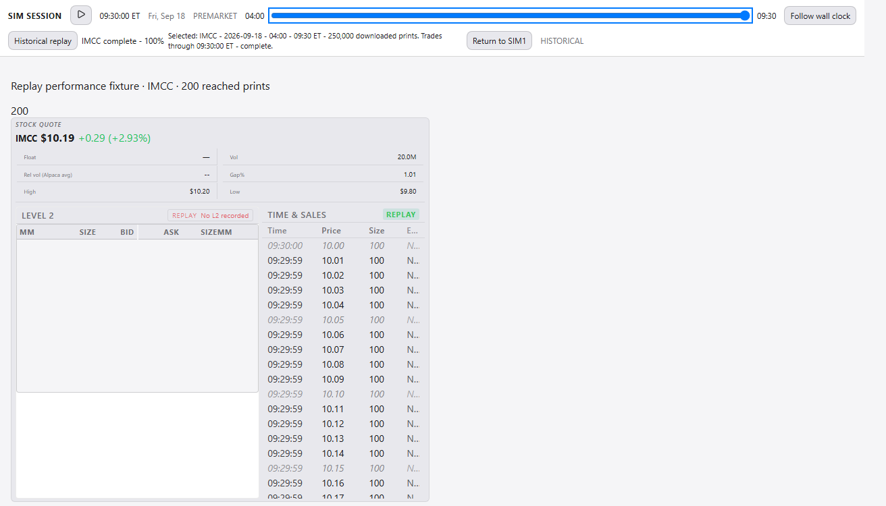

# Replay desk audit and browser measurements - 2026-09-20

Scope: #321, #322, #338, frontend #324 and the UI half of #341. The companion
[backend audit](replay-backend-audit-2026-09-20.md) reports the 250,000-print store,
early/mid/late p95, concurrent requests, selection/RSS, adverse inputs, restart
probe and all eight engine audit leads. Together these are the two delivered
audit reports; they do not claim an exhaustive clean bill of health.

## Method and limits

Windows Chromium through Playwright 1.61.1, Vite development server, 1280x720
viewport, no CPU/network throttling. Production SimSessionHeader and quote/tape
rail components run inside the real workspace/module providers and production
CSS. The tape receives 200 prints (the API display cap); two mounted consumers
request the same symbol. A paused mid-window replay and a running download stay
visible while the setup popup is closed. Each idle observation lasts 60 seconds.

Before is clean revision `17e2f3e5124819f7eeb5bf1c966b4b7e5578817c`, measured before
changing the hot paths. After is this PR. The new response includes stable print
ordinals and explicit job progress fields; the baseline rendered the same count
of rows with its older contract. Background machine load was not controlled.

**Browser API responses are deterministic Playwright routes, not the 250k SQLite
server or a Gateway.** These measurements isolate rendering, subscription counts,
layout and input behavior. The separate backend benchmark exercises real SQLite
and FastAPI TestClient, including serialization but excluding TCP transport.
Combined full-workstation load, live entitlements/pacing and prolonged leak tests
remain unmeasured; neither report implies a live trading or production SLA.

`PerformanceObserver` counts tasks above 50 ms and sums excess duration as total
blocking time. `requestAnimationFrame` estimates frame cadence; intervals above
34 ms are delayed-frame samples, not Chromium's compositor dropped-frame counter.
CDP JSHeapUsedSize is sampled without forcing GC: its drift alone cannot prove or
exclude a leak. Measurements and screenshots are committed beside this report.

## Paired idle results

| Measure (60 seconds) | Before | After |
|---|---:|---:|
| Snapshot requests, two consumers | 120 | 59 |
| History job-list requests, running job / popup closed | 60 | 59 |
| Clock requests | 60 | 59 |
| Capture-session refresh requests | 0 | 4 |
| IBKR status requests | 12 | 12 |
| Mean frame cadence | 60.00 fps | 60.02 fps |
| rAF samples above 34 ms | 0 | 0 |
| Long tasks above 50 ms | 0 | 0 |
| Total blocking time | 0 ms | 0 ms |
| Mounted tape rows, start/end | 26 / 26 | 26 / 26 |
| DOM nodes, start/end | 331 / 331 | 309 / 309 |
| JS heap, start/end bytes | 16,760,788 / 18,653,468 | 16,611,752 / 15,832,416 |

The improvement demonstrated here is shared polling: two snapshot consumers now
produce one request per second. The baseline did **not** exhibit low FPS or long
tasks, so there is no measured frame-rate improvement to claim. Tape virtualization
already existed at baseline; it was preserved, not introduced by this PR.

Active download status intentionally remains at one second even when closed.
When the only job becomes complete, the closed popup backs off to five seconds:
the separate 11-second observation saw **2 history requests**. Capture choices
refresh every 15 seconds, trading four lightweight requests per minute for fresh
recordings. Clock/status cadence remains necessary to expose external state.

The after tape viewport is 386 px with 4,400 px scroll height and only 26 mounted
rows for 200 prints, including after scrolling. Baseline viewport/scroll-height
fields are null because the original measurement used an incorrect selector;
the baseline row/node counts remain valid. Document height changed from 720 to
750 px with the persistent coverage line; the rail stays bounded and scrollable.

## Interaction and visual audit

- **Progress and truth (#321):** closed-header summary exposes running/paused/
  stalled/error/completed state, percentage and available ETA. Open rows show
  downloaded-through and observed elapsed time. A current running job takes
  priority over an older failure. ETA waits for observed cursor advance; a long
  window shows the 11-second pacing warning before download. Window length alone
  cannot predict print density/page count, so no invented duration or mandatory
  confirmation is presented. Recording staleness uses the existing shared server
  recording store rather than a second recorder timer.
- **Popup (#322):** opens below the complete header, closes on successful load,
  Escape and outside interaction, returns keyboard focus, remains within a
  768-pixel viewport, and leaves the scrubber reachable. A browser test reproduces
  the header's z-index 40 stacking context with a competing z-index 10050 overlay:
  the body portal wins hit-testing. This resolves the old stacking suspicion for
  the replaced implementation; the old app-wide overlay interaction was not
  separately reproduced on baseline.
- **Themes/accessibility (#338):** dark/light screenshots confirm theme-token
  surfaces; setup inputs, download actions and range have accessible names;
  progress/status/errors are exposed semantically. Shared tape/quote rail keeps
  module visibility and symbol gating. Negative count sentinels no longer render
  as negative print counts. This was a keyboard/DOM/browser audit, not a full
  screen-reader certification or exhaustive contrast audit.
- **Seeking (#324):** pointer drag generates one seek at release. Home then
  ArrowRight preserves focus and updates tape/chart; range stays focusable while
  POST is in flight. Chart, indicators and VWAP clear on rewind, ignore future
  quote patches and refill at the reached time. Stable ordinal keys preserve
  legitimate identical prints. Shared chart/VWAP refresh and seek invalidation
  prevent duplicate replacement fetches; invalidation cancels obsolete HTTP.
- **Resilience:** per-action busy ownership and request deadlines permit unrelated
  controls; HTML/network errors produce usable messages. Live selection metadata
  replaces stale success text and exposes missing coverage. Capture failures,
  invalid rows and depth decimation remain visible, and empty sessions cannot
  navigate the desk.

Browser verification exposed and fixed a disabled-slider focus regression.
A first after run also exposed duplicate ordinals in the test fixture (clamped
at zero at early playheads); that fixture was corrected and the final measured
run passed with zero console/page errors. Screenshots wait for rendered data,
not just the optimistic slider value.

## Visual evidence

Baseline light-theme popup (dark inline styles remained):



After dark and light popup, persistent progress, selected-window coverage and rail:





Rewind, early and late rendered playheads:







## Reproduce and verification

From `frontend` after `npm ci`:

```powershell
$env:REPLAY_MEASURE_LABEL='after'
npx playwright test e2e/replay-desk-measure.spec.ts --workers=1
```

The opt-in benchmark writes only `.tmp/replay-audit`; regular CI skips its
60-second measurement unless explicitly enabled. Functional browser regression
coverage remains enabled in `replay-desk.spec.ts`, `sim-replay-chart.spec.ts`,
`sim-session-scrub.spec.ts` and `capture-replay-truth.spec.ts`.

The combined browser run passed **7 tests**, including the 60-second benchmark.
The full frontend suite passed **1,715 tests in 331 files**; frontend lint and
production build passed. Later focused review fixes and their additional evidence
are recorded in the PR body. Vite's existing >500 kB chart-vendor chunk warning
remains advisory. Desktop packaging and a full desktop restart were not run locally.

The backend audit found separate candle-lookahead #385 and holiday-calendar #386;
both remain tracked and outside these UI/performance fixes. #320 retains its
operator-gated retention/delete policy; this PR only fixes daily append growth,
unused daily loading and default capture storage placement.
