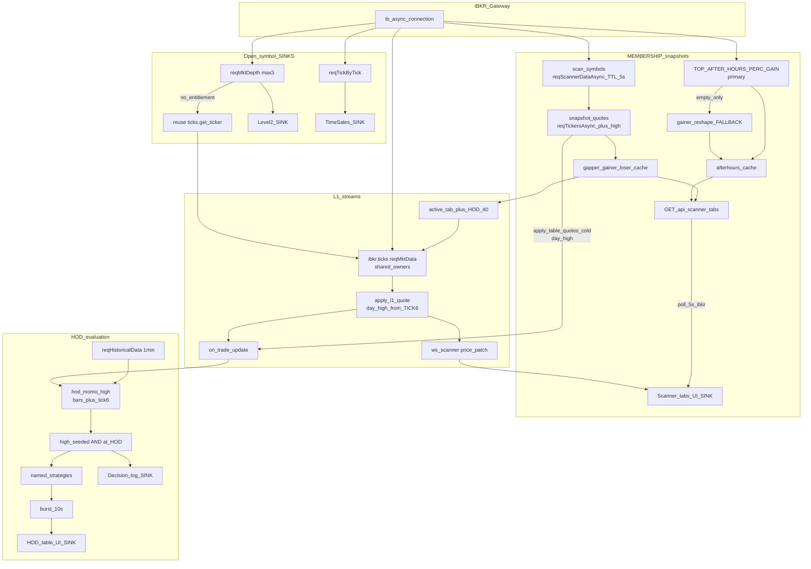
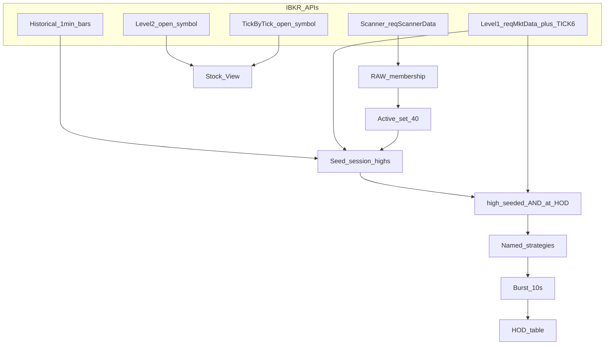

# IBKR Scanner + HOD Momentum architecture

Canonical durable home for IBKR API specialties, HOD truth, and feed UML.
**Owner:** `hod-momo` subagent (`.cursor/agent-system/registry.json` → `canonical_inputs` + `writable_paths`).
Companion: `.cursor/agent-memory/hod-momo-memory.md` · dashboard `agent-hod-momo.canvas.tsx`.
Plan (gap ledger + fuller diagrams): `hod_gate_uml_cleanup_69da0848.plan.md`.
**Last verified against code:** 2026-07-23 · ADR 008 (session-owned persistent scanner rosters) supersedes the polling membership section below — see `architecture/decisions/008-persistent-ibkr-scanner-rosters.md`.

## IBKR API specialties (memorize)

| Need | Call | Specialty |
|------|------|-----------|
| Who's moving? | `reqScannerData` / `reqScannerDataAsync` | Ranked membership ≤50/code. **No prices.** Short-TTL cache in `scan_symbols()` (5s). |
| Live price / day high? | `reqMktData` (L1) | last, volume, tick‑6 day High / tick‑7 day Low |
| One-shot quote? | `reqTickersAsync` | Cold snapshot (~11s). Returns `high`. Not table SLA. |
| Earlier highs / candles? | `reqHistoricalData` | OHLCV; `useRTH=0` for extended hours |
| Book depth? | `reqMktDepth` | L2; open symbol; **max 3**. L1 fallback reuses `ibkr.ticks` stream. |
| Every print? | `reqTickByTickData(AllLast)` | Time & Sales; open symbol only |

**Invariant:** scanner = membership; prices/HOD = L1 (+ bar seed). Never invent session high from first observed last.

## Session-owned persistent scanner rosters (ADR 008, 2026-07-23)

`reqScannerDataAsync` polling (5s TTL cache, 20s/30s/120s scan_loop cadence) is
replaced by `backend/ibkr/scanner_stream.py` owning **persistent**
`reqScannerSubscription` handles for the life of the process — IB pushes
`updateEvent` batches; Nova never re-polls a code that is already
subscribed.

- **Desired subscriptions by session period** (≤2 slots at once):
  Premarket = Gainers + Gappers; RTH = Gainers + Losers (UI-only);
  Afterhours = AH Gainers; Closed = none.
- **Table state model** (`backend/runtime_state/state.py`): each table
  (`gappers`/`gainers`/`losers`/`afterhours`) carries `session_key`
  (04:00 ET-anchored), `state` (`live`/`frozen`/`unavailable`), `revision`,
  `roster_ts`, `quote_ts`, `frozen_at`.
- **Freeze boundaries:** Gappers freezes at 09:30 ET, Gainers at 16:00 ET,
  Afterhours at 20:00 ET. A frozen table's membership/rank/values/timestamp
  are immutable; HOD-owned L1 may keep evaluating retained symbols without
  mutating the frozen row.
- **Fencing:** every scanner/hydration callback is checked against IB READY
  generation, a local subscription epoch, the target table, and the session
  key before it can write state — late results from a superseded
  generation/epoch/session are discarded.
- **HOD eligibility narrowed:** the active set is exactly current-session
  Gappers ∪ Gainers ∪ Afterhours ∪ manually curated Former Momo. Volume
  seeds (`HOT_BY_VOLUME`/`TOP_VOLUME_RATE`/`MOST_ACTIVE`), the `belowPrice=20`
  Gainers pass, open-ticker priority, Losers, and rotating "explore" are
  removed from HOD admission — sub-$20 stocks are ordinary Gainers rows.

The "VERIFIED live flow" mermaid diagram below still describes the
membership layer as one-shot `reqScannerDataAsync` polling; treat that
diagram as historical until the `hod-momo` specialist refreshes it to show
the persistent-subscription membership layer (follow-up, not blocking this
ADR).

## HOD truth (2026-07-17)

1. On admission, seed session high from bar `max(h)` (same hist fetch as surge seed) and/or L1 `ticker.high` (tick 6).
2. Mark `high_seeded` before any `requires_hod` strategy may fire.
3. After seeded, last prints may raise the tracked high (true new HOD).
4. Gate: `last + epsilon >= session_high` with `epsilon = max($0.01, 0.1% of high)`.
5. Cold path (`apply_table_quotes`) and live path (`apply_l1_quote`) both pass `day_high` into `on_trade_update`.

## Rate limit

- Anti-spam **mute removed** (`cooldown_sec = 0`).
- Warrior burst = **10s consolidation** only (`HOD_MOMO_CONSOLIDATION_SEC` / UI `HOD_BURST_GAP_SEC`).

## Master gate

Master = data-ready (+ optional master surge). **No master RVOL.** Per-strategy `min_rvol` remains (Float RelVol etc.). Soft bypass deleted.

## Shipped vs TARGET

| Piece | Status |
|-------|--------|
| HOD truth seed (tick-6 + bars), `high_seeded` gate, burst 10s, mute off | **Shipped** |
| Dedicated AH scan `TOP_AFTER_HOURS_PERC_GAIN` (gainer reshape = fallback) | **Shipped** |
| `scan_symbols` 5s TTL cache; cold `day_high`; depth L1 reuse; 5s IBKR UI poll | **Shipped** |
| `Central_scanner_service` + versioned RAW store + raw-scanner debug UI | **TARGET** (Phase 3 deferred) |

## VERIFIED live flow (discovery=ibkr, post gap-fix)

## Compact HOD path (same truth, fewer nodes)

## Related code

- `architecture/decisions/008-persistent-ibkr-scanner-rosters.md` — session-owned roster ADR
- `backend/ibkr/scanner_stream.py` — persistent scanner subscriptions, freeze/rollover
- `backend/hod_momo_high.py` — seed / tick-6 floor
- `backend/hod_momo_trade.py` — evaluate on L1
- `backend/ibkr/ticks.py` — stores `day_high`
- `backend/ibkr_bridge.py` — `apply_l1_quote` + `apply_table_quotes` both pass `day_high`
- `backend/ibkr/discovery.py` — TTL cache + `get_afterhours_gainers`
- `backend/scanner_runners/afterhours.py` — AH scan primary, reshape fallback
- `backend/ibkr/depth/subscribe.py` — L1 fallback reuses ticks
- `frontend/src/hooks/useScannerData.ts` — 5s poll when discovery=ibkr
- `backend/hod_momo_surge_seed.py` — bars also seed session high
