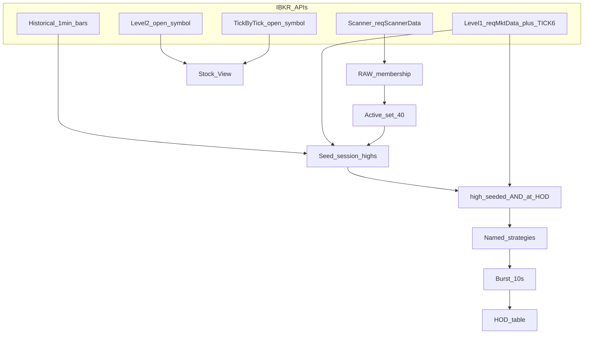

# IBKR Scanner + HOD Momentum architecture

Canonical durable home for IBKR API specialties, HOD truth, and feed UML.
Companion: `.cursor/agent-memory/hod-momo-memory.md` · dashboard `agent-hod-momo.canvas.tsx`.

## IBKR API specialties (memorize)

| Need | Call | Specialty |
|------|------|-----------|
| Who's moving? | `reqScannerData` / `reqScannerDataAsync` | Ranked membership ≤50/code. **No prices.** |
| Live price / day high? | `reqMktData` (L1) | last, volume, tick‑6 day High / tick‑7 day Low |
| One-shot quote? | `reqTickersAsync` | Cold snapshot (~11s). Not table SLA. |
| Earlier highs / candles? | `reqHistoricalData` | OHLCV; `useRTH=0` for extended hours |
| Book depth? | `reqMktDepth` | L2; open symbol; **max 3** |
| Every print? | `reqTickByTickData(AllLast)` | Time & Sales; open symbol only |

**Invariant:** scanner = membership; prices/HOD = L1 (+ bar seed). Never invent session high from first observed last.

## HOD truth (2026-07-17)

1. On admission, seed session high from bar `max(h)` (same hist fetch as surge seed) and/or L1 `ticker.high` (tick 6).
2. Mark `high_seeded` before any `requires_hod` strategy may fire.
3. After seeded, last prints may raise the tracked high (true new HOD).
4. Gate: `last + epsilon >= session_high` with `epsilon = max($0.01, 0.1% of high)`.

## Rate limit

- Anti-spam **mute removed** (`cooldown_sec = 0`).
- Warrior burst = **10s consolidation** only (`HOD_MOMO_CONSOLIDATION_SEC` / UI `HOD_BURST_GAP_SEC`).

## Master gate

Master = data-ready (+ optional master surge). **No master RVOL.** Per-strategy `min_rvol` remains (Float RelVol etc.). Soft bypass deleted.

## Target UML

## Related code

- `backend/hod_momo_high.py` — seed / tick-6 floor
- `backend/hod_momo_trade.py` — evaluate on L1
- `backend/ibkr/ticks.py` — stores `day_high`
- `backend/hod_momo_surge_seed.py` — bars also seed session high
