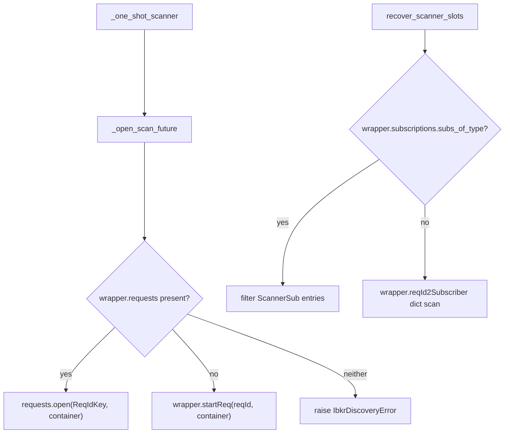

# 2026-07-31 -- Fix empty gappers/gainers after ib_async pin (startReq removal)

- **Status:** completed
- **Agents:** parent
- **Domain:** market-feed / ibkr-ops (in-session)
- **Related:** `CHANGELOG.md` §2026-07-31 · `PROBLEM_LOG.md` §2026-07-31 Empty gappers/gainers · §2026-07-30 Error 10349 (the pin-bump trigger)

## Task

Gappers and gainers were empty with IB Gateway connected. Investigate the root cause, fix it, and make sure the same class of failure cannot silently recur after a future `ib_async` pin change.

## Goal

Scanner discovery (gappers/gainers/losers/HOD seeds) works again against the current `ib_async` pin, the Error-322 slot-recovery path still works, and a regression test exists that fails loudly in CI the next time a library pin removes/renames the scanner API surface -- instead of the UI just looking "empty."

## Why it mattered

IB Gateway showed connected and `market_data_type=1`, so this looked like a login or "quiet market" problem -- exactly the kind of thing `ibkr-gateway-login-warning.mdc` warns not to assume. The real cause was a code/library mismatch from the previous day's own pin bump, which nobody had re-verified against scanner discovery (only order placement was tested that session).

## What we changed

- `backend/ibkr/discovery.py`: added `_open_scan_future(ib, data_list)` -- prefers `wrapper.requests.open(ReqIdKey(reqId), container=data_list)` (current `ib_async` pin `c9f4c14`), falls back to legacy `wrapper.startReq(reqId, container=data_list)` for older pins, raises `IbkrDiscoveryError` loudly if neither exists. `_one_shot_scanner()` now calls this helper instead of `ib.wrapper.startReq` directly.
- `recover_scanner_slots()`: primary path now walks `wrapper.subscriptions.subs_of_type(ScannerSub)` (typed registry); falls back to the legacy `wrapper.reqId2Subscriber` dict scan for older pins. ADR 008 persistent-lease fencing (`scanner_stream.persistent_reqids()`) unchanged.
- `_load_ib_types()`: additionally (best-effort) resolves `ib_async._subscriptions.ScannerSub` and `ib_async._requests.ReqIdKey`, caching them alongside the existing `Stock`/`ScannerSubscription`/`ScanDataList` globals.
- Updated fakes in `backend/tests/test_ibkr_discovery.py` and `backend/tests/test_ibkr_discovery_fail_loud.py` to model the current typed-registry shape (`wrapper.requests.open` / `wrapper.subscriptions.subs_of_type`) as the primary path, while keeping one dedicated legacy-fallback test (`test_recover_scanner_slots_legacy_registry_fallback`) so the fallback branch itself stays covered.
- Added `backend/tests/test_ibkr_async_scanner_api_compat.py` -- imports the **real** installed `ib_async` package (no fakes), asserts the exact attributes/methods `discovery.py` depends on, and drives a real (unconnected) `IB()` instance through `_open_scan_future()` end-to-end.

## How it works now

`_open_scan_future` and `recover_scanner_slots` each detect which `ib_async` registry shape is present at runtime rather than assuming one pin. `test_ibkr_async_scanner_api_compat.py` is the tripwire: it never mocks `ib_async`, so if a future pin renames/removes `wrapper.requests`, `ReqIdKey`, `wrapper.subscriptions`, or `ScannerSub`, that test fails in CI before anyone notices empty scanner tables in the UI.

## Why this approach

- **Keep the `c9f4c14` pin, do not revert to PyPI `2.1.0`.** The pin exists to fix Error 10349 (false-Cancelled on live orders -- PROBLEM_LOG 2026-07-30), which is a money-adjacent correctness fix. Reverting it to unbreak scanners would silently reintroduce that bug; the correct fix is adapting to the new API, not downgrading.
- **Primary/fallback dispatch instead of a hard-pinned single API call.** A pure "just call `requests.open`" fix would work today but reproduces the same failure mode on the *next* pin bump if that API also moves. Detecting the available surface at runtime (with a loud failure if neither shape exists) means a partial-rollback or an in-between commit does not also require a code change.
- **Real-import compat test, not another fake-based unit test.** The existing discovery tests all use `_FakeIB` doubles that model whatever shape the test author wrote them against -- that is exactly how this bug went unnoticed for a full day: the fakes still had `startReq` even after the real library removed it. A test that imports the actual installed `ib_async` and asserts on its real attributes is the only test shape that would have caught this before it reached a running process.
- **Rejected:** reverting the pin (reintroduces 10349); patching only `_one_shot_scanner` without `recover_scanner_slots` (would silently break Error-322 recovery on the next slot exhaustion, a much harder bug to diagnose than an immediate `AttributeError`).

## Verification

- `pytest backend/tests/test_ibkr_discovery.py backend/tests/test_ibkr_discovery_fail_loud.py backend/tests/test_scanner_session_adr008.py backend/tests/test_ibkr_async_scanner_api_compat.py` -- 45 passed.
- Full backend suite: `pytest` from `backend/` -- 1067 passed (one pre-existing, unrelated collection error in `test_execution_latency_regressions.py` from a `tools` import path issue, excluded; one pre-existing FinBERT/torchvision native-crash traceback mid-run from `news/sentiment.py`'s lazy pipeline import, unrelated to this change, run still completed and passed).
- Live: confirmed against the running API process + connected IB Gateway that `/api/integrity`'s `scanner_ibkr_bridge` check no longer reports `startReq`, and `/api/gappers` / `/api/movers` produce fresh (`last_scan > 0`) results.

## Follow-ups

- None required by this fix. If a future `ib_async` pin bump breaks `test_ibkr_async_scanner_api_compat.py`, extend `_open_scan_future` / `recover_scanner_slots` with a third branch for the new shape rather than replacing the existing fallback (keep supporting whichever pins are actually in use).

## Keywords

startReq, AttributeError, ib_async, c9f4c14, RequestRegistry, ScannerSub, ReqIdKey, reqId2Subscriber, empty gappers, empty gainers, last_scan=0, scanner_ibkr_bridge, pin bump, requests.open, subs_of_type, compat test, regression guard
